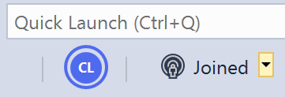
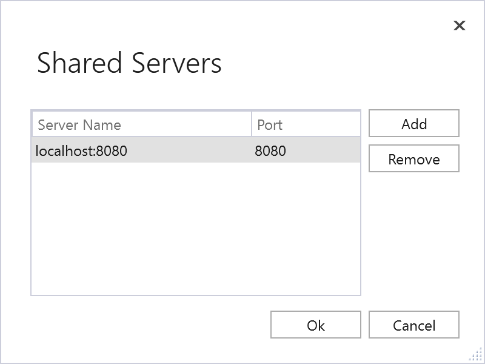

<!--
Copyright © Microsoft Corporation
All rights reserved.
Creative Commons Attribution 4.0 License (International): https://creativecommons.org/licenses/by/4.0/legalcode
-->

# Visual Studio Enabled Features

This document provides information on capabilities enabled by the Visual Studio Live Share extension for Visual Studio. See [getting started](getting-started.md) for information on sharing and joining collaboration sessions in VS and other tools.

**Table of Contents**

- [Recap: Collaboration session host and guests](#recap-collaboration-session-host-and-guests)
- [Collaborative editing](#collaborative-editing)
- [Collaborative debugging](#collaborative-debugging)
- [Additional capabilities](#additional-capabilities)
  - [Sharing a local server](#sharing-a-local-server)
- [Known guest limitations](#known-guest-limitations)
- [More information](#more-information)
  - [Getting started and managing collaboration sessions](getting-started.md)
  - [Visual Studio Code features](collab-vscode.md)

## Recap: Collaboration session host and guests

All collaboration activities in Visual Studio Live Share involve a single **collaboration session host** and one or more **guests**. The host is the person that started the collaboration session and anyone that joins is a guest. See [getting started](getting-started.md) for information on starting and joining collaboration sessions.

Collaboration session hosts can use all of their tools and services as they would normally but guests are only given access to the specific things the host has shared with them. This includes code, running servers, debugging sessions and more.  Currently all content that is shared is kept on the host's machine and not synchronized to the cloud or on the guest's machine which enables _instant access_ and _increased security_.  The advantage is that the entire solution is available the moment a guest joins and the moment a host ends a collaboration session the content is no longer available. Further, temp files created by the IDE/editor to improve performance for the guest are automatically cleaned up when the session ends.

## Collaborative editing

Once a guest has joined a collaboration session, the host other guests will immediately be able to see each others edits and highlights in real-time. Simply select a file from the Solution Explorer and start editing. Guests will see edits as the host or other guests make them and can contribute themselves in real time so you can iterate and rapidly nail to down solutions.

In addition, each guest can navigate to any file in the shared project. This means you can edit together in the same file or independently in separate files and thus seamlessly switch between investigation, small tweaks, and collaborative editing. The resulting edits are persisted on the host's machine so there is no need to synchronize, push, or send files around once you're done editing. The edits are "just there."

Further, to better allow you to highlight where problems might exist or convey ideas, selections are also visible to all guests.

### Moving to another person's edit location

Each person in your the session can be seen in the upper right and you can hover over the avatar to see their full information.  Further, simply clicking on this same icon to jumps the active editor to their exact location.

### Pinning to a collaborator's edit location

At times the person you are collaborating with may need to show you a few different places in code to explain a problem or possible solution. While you could repeatedly jump to their location as described above you can also "pin" the editor to their location.

Simply hover over a user and you will see a pin icon. Simply click the pin to start following them and as the collaborator moves around or between files you will be moved along with them.

To make it easy to hop in and out of pinning, the editor is un-pinned if any of the following occurs:

1. You edit or make a selection
2. You click the pin icon again

Afterwards you can simply click the pin icon again to follow their location once again.

## Collaborative debugging

Visual Studio Live Share's collaborative debugging feature is a powerful and unique way to debug an issue. Beyond enabling a collaborative experience to troubleshoot problems it also gives all collaborators the ability to investigate issues that may be environment specific by providing a shared debugging session on the host's machine.

> **Note:** All traffic is secured and encrypted and access is limited to only those resources needed to facilitate debug and browser access to the web application. These resources are only available to guests of the collaboration session.

Using it simple. The collaboration session host simply needs to start debugging via the usual means in Visual Studio.

Once the debugger attaches on the host's side, all guests are also attached. While there is one debugging "session" running on the host's machine, all collaborators are connected to it and have their own view. 

> **Tip:** If you want to change when and how co-debugging happens, you can change the default behaviors via settings in **Tools > Options > Live Share**.

Anyone can step through the debugging process which enables seamless switching between collaborators without having to negotiate control.

Each collaborator can investigate different variables, jump to different files in the call stack, variables, and breakpoints are shared across all guests and can be added by anyone. Co-editing features then allow each collaborator to track where the other is located to provide the unique ability to seamlessly switch between concurrently investigating different aspects of the problem and collaboratively debugging.

> **Tip:** You can participate in VS Code debugging sessions from VS and vice versa! If the host is using VS Code, you can check out the [VS Code instructions](collab-vscode.md#collaborative-debugging) but the steps are roughly the same. 

## Automatic web app sharing during debugging

Even better, by default if the host's project is configured to automatically start a web browser to connect to the running web application when debugging, Live Share will automatically do the same on each guest's machine!

This is done in a secure way and the remote web application is only available to the guests during the debugging session by default.  See [sharing a local server](#sharing-a-local-server) for information on how to share server access for the duration of the session.

> **Tip:** If you don't like the automated browser sharing behavior and want to change it (either when you are an host or a guest), you can update settings in **Tools > Options > Live Share**.

## Detaching, attaching, or reattaching to a co-debugging session

Since guests may wish to stop debugging temporarily, they can simply click the "stop" icon in the debug toolbar to detatch the debugger without affecting the host or other guests.

If you've updated settings so that as a guest you do not auto-attach to a co-debugging session or if you simply want to re-attach later, you can simply select the desired running debugging session from the "Select Startup Item..." dropdown...

...and then click it to attach.

## Additional capabilities

### Sharing a local server

From time to time, as a collaboration session host you may find that you want to share additional local servers or services with guests. This can range from other RESTful end-points to databases or other servers.  For security purposes, only servers running on ports you specify are available to other guests. Fortunately, its easy to add another one.

1. Click on the session state button in the upper right corner and select "Manage Shared Local Servers"

2. In the dialog that appears, click "Add" and enter the port number the server is running on locally and a name, hit enter, then OK.

That's it!

Guests will now be able to use this same port from their machine to access the server or service if it is free. Otherwise it will be automatically mapped to a free port. You can view shared local servers by clicking the session state button in the upper right corner and selecting "View Shared Local Servers."

To **stop** sharing a local server, the host simply needs to hare state button in the upper right corner as above, select "Manage Shared Local Servers", and select the appropriate port, and click "Remove".

## Known guest limitations

While there are currently some shortcomings guests will experience while using the features described above, collaboration session hosts retain the complete functionality of their tool of choice. See the following for more information:

- [All major bugs, feature requests, and limitations](http://aka.ms/vsls-issues)
- [All feature requests and limitations](http://aka.ms/vsls-feature-requests)
- [Co-editing feature requests and limitations](http://aka.ms/vsls-feature-requests/co-edit)
- [Co-debugging feature requests and limitations](http://aka.ms/vsls-feature-requests/co-debug)

## More information

- [Getting started](getting-started.md)
- [Visual Studio Code features](collab-vscode.md)
- [FAQ](https://aka.ms/vsls-faq)
