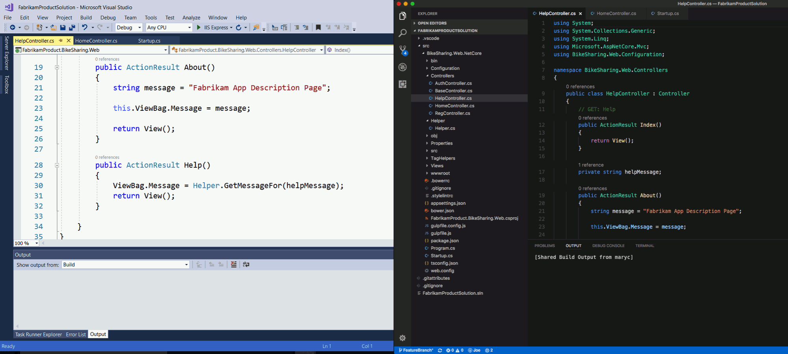
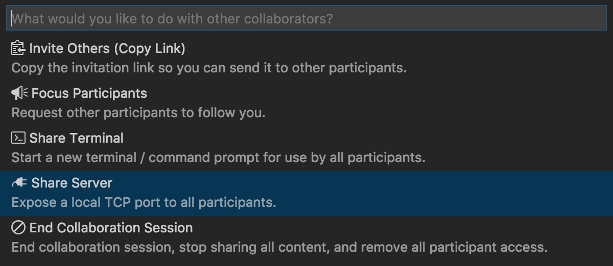

<!--
Copyright © Microsoft Corporation
All rights reserved.
Creative Commons Attribution 4.0 License (International): https://creativecommons.org/licenses/by/4.0/legalcode
-->

# Visual Studio Code Enabled Features

This document provides information on capabilities enabled by the Visual Studio Live Share extension for Visual Studio Code. See [getting started](getting-started.md) for information on sharing and joining collaboration sessions in VS Code and other tools.

**Table of Contents**

- [Recap: Collaboration session host and guests](#recap-collaboration-session-host-and-guests)
- [Command palette and scoped command menu](#command-palette-and-scoped-command-menu)
- [Collaborative editing](#collaborative-editing)
- [Collaborative debugging](#collaborative-debugging)
  - [Sharing the running application in a browser](#sharing-the-running-application-in-a-browser)
- [Additional capabilities](#additional-capabilities)
  - [Sharing a local server](#sharing-a-local-server)
- [Known guest limitations](#known-guest-limitations)
- [More information](#more-information)
  - [Getting started and managing collaboration sessions](getting-started.md)
  - [Visual Studio features](collab-vs.md)

## Recap: Collaboration session host and guests

All collaboration activities in Visual Studio Live Share involve a single **collaboration session host** and one or more **guests**. The host is the person that started the collaboration session and anyone that joins is a guest. See [getting started](getting-started.md) for information on starting and joining collaboration sessions.

Collaboration session hosts can use all of their tools and services as they would normally but guests are only given access to the specific things the host has shared with them. This includes code, running servers, debugging sessions and more.  Currently all content that is shared is kept on the host's machine and not synchronized to the cloud or on the guest's machine which enables _instant access_ and _increased security_.  The advantage is that the entire solution is available the moment a guest joins and the moment a host ends a collaboration session the content is no longer available. Further, temp files created by the IDE/editor to improve performance for the guest are automatically cleaned up when the session ends.

## Command palette and scoped command menu

Nearly all Visual Studio Live Share functions are available from the Visual Studio Code "Command Palette" that can be accessed using Ctrl + Shift + P or F1. You can find a complete list of commands by typing "live share".

However, since this list can get long, you may find it easier to take advantage of a scoped command menu available from the status bar. Clicking on the sign in / session state icon in the status bar will immediately bring up a contextualized list of commands that are available for you to use.

This document will assume you are using this command menu but note that these commands are also available from the VS Code command palette if you prefer.

## Collaborative editing

Once a guest has joined a collaboration session all collaborators will immediately be able to see each others edits and highlights in real-time. 

Simply select a file from the file explorer and start editing. Guests will see edits as you make them and can contribute themselves in real time so you can iterate and rapidly nail to down solutions.

In addition, each collaborator can navigate to any file in the shared project. This means you can edit together in the same file or independently in separate files and thus seamlessly switch between investigation, small tweaks, and collaborative editing. The resulting edits are persisted on the host's machine so there is no need to synchronize, push, or send files around once you're done editing. The edits are "just there."

Further, to better allow you to highlight where problems might exist or convey ideas, selections are also visible to all guests.

### Moving to a collaborator's edit location

Since you may want to quickly jump to where another collaborator is located, if there is only one other person in the session you can hover over a status bar icon that shows the number of collaborators to see who is in the collaboration session. Simply clicking on this same icon to jumps the active editor to their exact location.

If there is more than one other person in the collaboration session, clicking on the icon presents a list of those currently in the collaboration session. You may then select a collaborator from the list to jump to their location.

### Pinning to a collaborator's edit location

At times the person you are collaborating with may need to show you a few different places in code to explain a problem or possible solution. While you could repeatedly jump to their location as described above you can also "pin" a tab set to their location.

Simply click on the pin icon in the upper right of the tab set. As above, if more than one other person is in the collaboration session you'll be asked to select the guest you want to follow.

The pin is for a tab set so you can use split view to have a set that is pinned and a set that is unpinned if you so desire.

To make it easy to hop in and out of pinning, the tab set is un-pinned if any of the following occurs:

1. You edit or make a selection
2. You click the pin icon again

Afterwards, simply click the pin icon again to follow them once again.

## Collaborative debugging

Visual Studio Live Share's collaborative debugging feature is a powerful and unique way to debug an issue. Beyond enabling a collaborative experience to troubleshoot problems it also gives all collaborators the ability to investigate issues that may be environment specific by providing a shared debugging session on the host's machine.

Using it simple.

1. Be sure both the host and all guests have the appropriate debugging extension installed. 

2. If not already set up for the project, the host should [configure launch.json](https://code.visualstudio.com/Docs/editor/debugging#_launch-configurations) to debug the application from VS Code as you would normally. No special setup is required.

3. Next, start debugging using the button in the debug tab as normal.

    

    > **Tip:** You can participate in VS debugging sessions from VS Code and vice versa! If the host is using Visual Studio, you can check out the [Visual Studio instructions](collab-vs.md#collaborative-debugging) but the steps are roughly the same. 

Once the debugger attaches on the host's side, all guests are also attached. While there is one debugging "session" running on the host's machine, all collaborators are connected to it and have their own view. 

Anyone can step through the debugging process which enables seamless switching between collaborators without having to negotiate control.

Each collaborator can investigate different variables, jump to different files in the call stack, variables, and breakpoints are shared across all guests and can be added by anyone. Co-editing features then allow each collaborator to track where the other is located to provide the unique ability to seamlessly switch between concurrently investigating different aspects of the problem and collaboratively debugging.

## Detaching, attaching, or reattaching to a co-debugging session

Since guests may wish to stop debugging temporarily, they can simply click the "stop" icon in the debug toolbar to detatch the debugger without affecting the host or other guests.

If you've updated settings so that as a guest you do not auto-attach to a co-debugging session or if you simply want to re-attach later, you can use click on the session state status bar icon and then select the "Attach to a Shared Debugging Session" from the scoped command menu.

### Sharing the running application in a browser

Visual Studio Code does not have the concept of an known "web application port" like Visual Studio for project types such as ASP.NET. However, if you are joining a collaboration session with a VS user that does you will automatically see the default browser appear connected to the host's running applications. See [Visual Studio features](collab-vs.md#automatic-web-app-sharing-during-debugging) for more details.

In addition, you can manually share the application or other endpoints like RESTful services using the "Share Local Server" feature. VS and VS Code guests can then open a browser on the same localhost port to see the running appliction.  See [sharing a local server](#sharing-a-local-server) for more details.

## Additional capabilities

### Sharing a local server

From time to time, as a collaboration session host you may find that you want to share additional local servers or services with guests. This can range from other RESTful end-points to databases or other servers.  For security purposes, only servers running on ports you specify are available to other guests. Fortunately, its easy to add another one.

1. First, the host should click on the session state status bar icon.

     

2. Select "Share Local Server"

     

3. Enter the port number the server is running on and optionally a name.

     

That's it!

Optionally, guests can see a list of currently shared ports (by name if specified) by clicking on the session state status bar icon as above and selecting "Access Shared Server".  Selecting one copies it to the clipboard.

 

To **stop** sharing a local server, the host simply needs to click the session state status bar icon as above, select "Stop Sharing Local Server", and select the port they want to stop sharing.

 

## Known guest limitations

While there are currently some shortcomings guests will experience while using the features described above, collaboration session hosts retain the complete functionality of their tool of choice. See the following for more information:

- [All major bugs, feature requests, and limitations](http://aka.ms/vsls-issues)
- [All feature requests and limitations](http://aka.ms/vsls-feature-requests)
- [Co-editing feature requests and limitations](http://aka.ms/vsls-feature-requests/co-edit)
- [Co-debugging feature requests and limitations](http://aka.ms/vsls-feature-requests/co-debug)

## More information

- [Getting started](getting-started.md)
- [Visual Studio features](collab-vs.md)
- [FAQ](https://aka.ms/vsls-faq)
