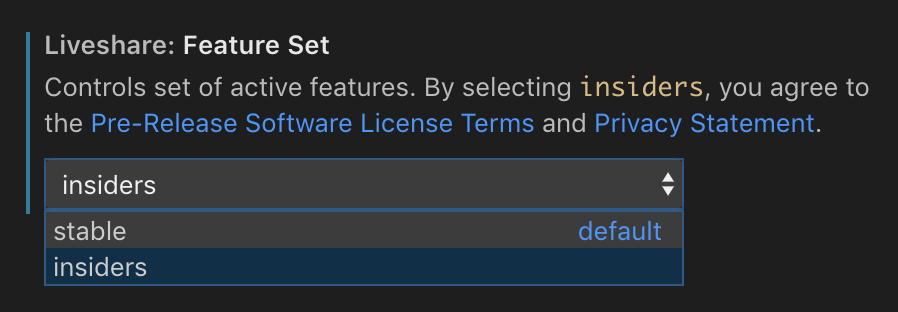

<!--
Copyright © Microsoft Corporation
All rights reserved.
Creative Commons Attribution 4.0 License (International): https://creativecommons.org/licenses/by/4.0/legalcode
-->

# Insiders

The Visual Studio Live Share team tries to iterate rapidly in order to address user feedback, and as part of that, we offer two seperate feature "channels" that allow you to decide how quickly you recieve new features. By default, after installing the Visual Studio Live Share extension, you're using the `Stable` feature set, which includes all of the production-ready capabilities (e.g. co-editing, shared debugging, terminals). However, if you'd like to get early access to feature we're working on, you can opt-in to the `Insiders` feature set by changing the following setting in your IDE:

* Visual Studio

    

* Visual Studio Code 

    

The following sections describe the set of capabilities that are currently within the `Insiders` feature set, and therefore, are ready to evaluate once you change the aforementioned setting:

## Direct User Invitations

Currently, both Visual Studio and Visual Studio Code provide a `Contacts` pane, which enables two key functions:

1. Displaying a list of `Suggested Contacts`, which are developers that have contributed to your currently open project within the last 30 days. In practice, these are the folks you're likely to want to collaborate with, and therefore, we suggest them in order to make it easier to get started.

2. Providing the list of `Recent Contacts`, which are developers  you've previously collaborated with using Live Share. In practice, most developers frequently collaborate with the same people, and therefore, the recent list enables a more repeatable means of working with your team/classroom/etc.

However, the `Contacts` list currently only allows you to invite recent/suggested contacts via e-mail, which we've learned isn't as efficient as it could be. If you install the latest Live Share update, and enable `Insiders` (as described above), you'll now be able to **invite developers into a collaboration session directly from the IDE**!

<em>A Live Share host (left) directly inviting a peer (right) into a session</em>

Once developers sign-in with Live Share, their availability status will be published to their peers. As a result, you can see that someone on your team is online, and then immediately start collaborating with them. They'll get a toast notification that gives them the option to join the session or not. This removes the need to exchange session URLs entirely.

After 5 minutes of inactivity, your status will automatically switch to `Away`, and when you're within a Live Share session, your status will automatically switch to `Do not disturb` (which suprresses invitation toast notifications). After you become active again and/or leave a Live Share session, your status will automatically switch back to `Available`. With this behavior, you don't need to actually manage your Live Share status. It's simply there to enable direct invitations, and communicate to your peers whether you're available for collaboration or not. However, you can always manually set your status if you prefer.

If you want to opt-out of this feature, you can simply disable the `Presence` setting within the Live Share settings in Visual Studio and Visual Studio Code. Once disabled, you'll still be able to see other's status and invite them, but your status won't be published, and others can't directly invite you.

## See also

- [Language and platform support](platform-support.md)
- [Connectivity requirements for Live Share](connectivity.md)
- [Security features of Live Share](security.md)
- [All major bugs, feature requests, and limitations](https://aka.ms/vsls-issues)
- [All feature requests and limitations](https://aka.ms/vsls-feature-requests)

Having problems? See [troubleshooting](../troubleshooting.md) or [provide feedback](../support.md).
